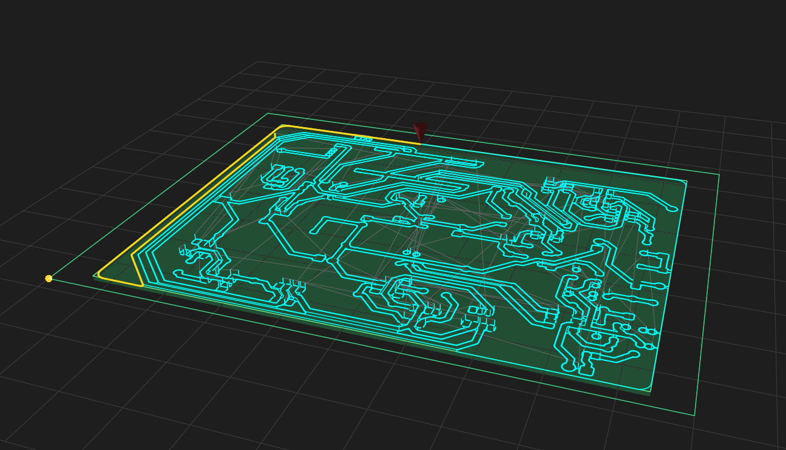
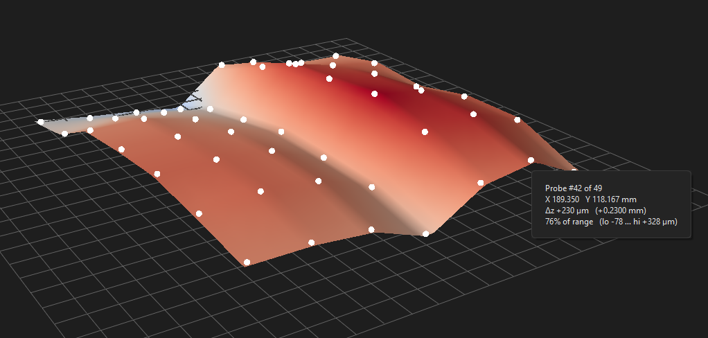
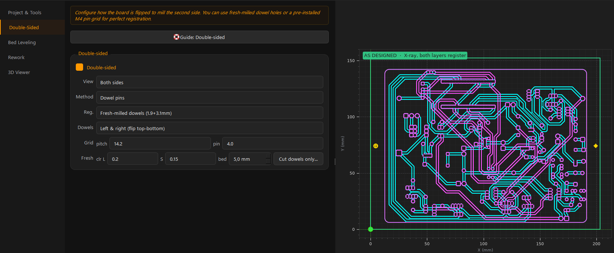
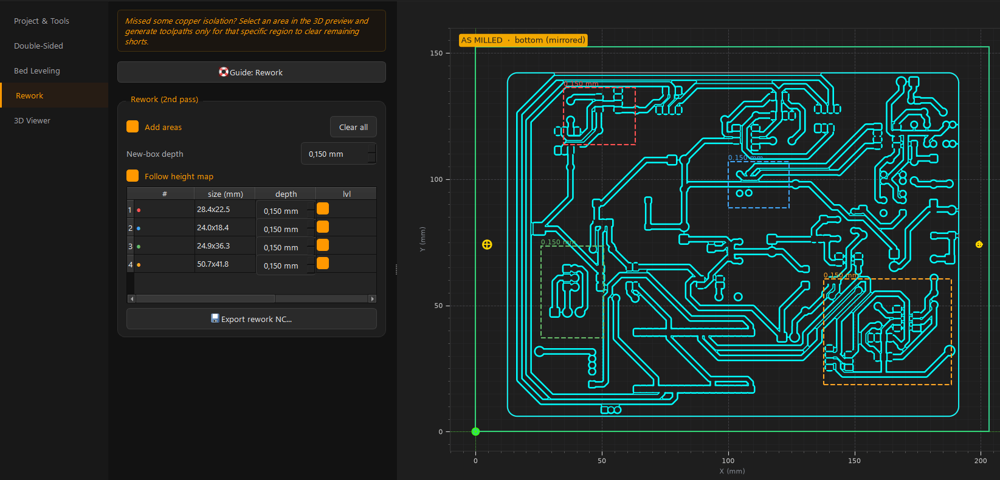

# SRM-CAM

Desktop CAM for the **Roland SRM-20** mill: load KiCad **Gerber + Excellon**,
preview the toolpaths, and export **G-code** (`.nc`) or RML. One tool we own,
replacing the mods site and FlatCAM.

> Python package name: `gerber2rml`.


## Install

**Just run it (Windows):** download the latest installer from
[Releases](https://github.com/MadsRudolph/srm-cam/releases) and run
`SRM-CAM-Setup-*.exe`. No Python needed.

**From source:**

```bash
pip install -e ".[gui]"
python -m gerber2rml                                          # GUI
python -m gerber2rml.cli <gerber-folder> -o out -n <board>   # headless CLI
```

After a `git pull`, `python -m gerber2rml.doctor` installs any new dependencies.

## What it does

- **Traces / drill / cut-out** from Gerber + Excellon, exported per operation.
- **G-code default** (`.nc`, G54 origin) for VPanel NC mode; RML available.
- **Double-sided** registration — dowel pins or measured fiducials.
- **Bed leveling** — probe a height map so depth follows an uneven surface.
- **Rework** — mark several spots, re-cut them in one pass at per-region depth.
- **3D views** — toolpath simulation + bed height-map.
- **Guided tour** — launches on first run; replay via the **Guide** button (and
  per-section buttons). A demo board loads so new users can follow along.

## Showcase

<table>
<tr>
<td width="50%"><br><sub><b>3D toolpath simulation</b> — orbit and play back the whole job before cutting.</sub></td>
<td width="50%"><br><sub><b>Bed height-map</b> — probe the surface so the cut depth follows the board.</sub></td>
</tr>
<tr>
<td width="50%"><br><sub><b>Double-sided</b> — dowel-pin or measured-fiducial registration for the flip.</sub></td>
<td width="50%"><br><sub><b>Rework</b> — box every spot to re-cut, each with its own depth, in one pass.</sub></td>
</tr>
</table>

## More

- Full usage & feature reference: [`docs/usage.md`](docs/usage.md)
- Build the installer: [`packaging/README.md`](packaging/README.md)
- Run the tests: `pytest`
