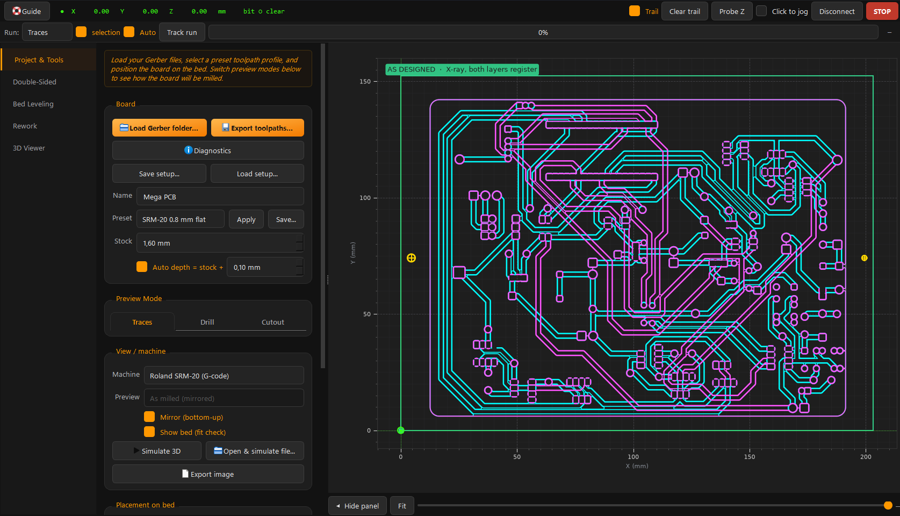
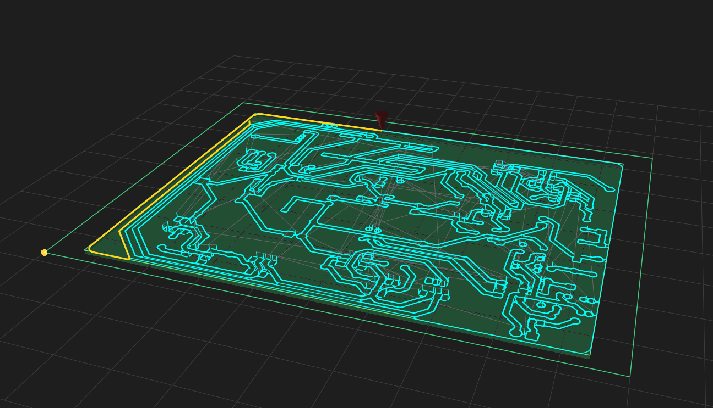
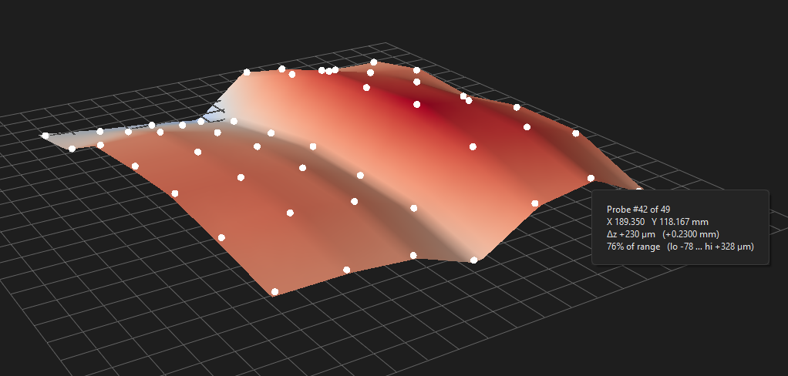
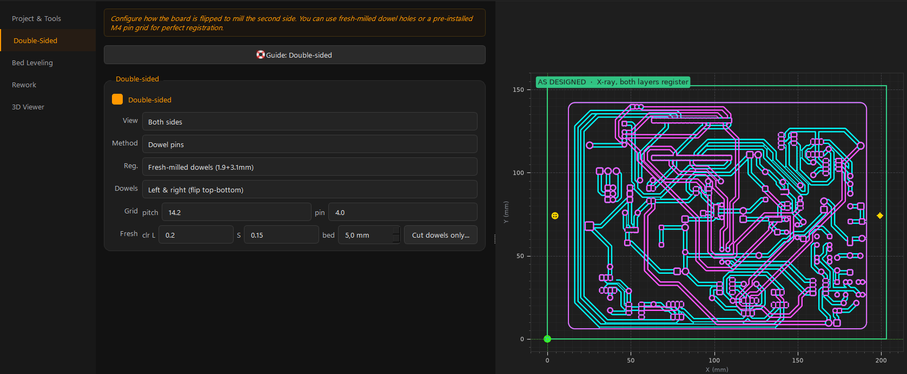
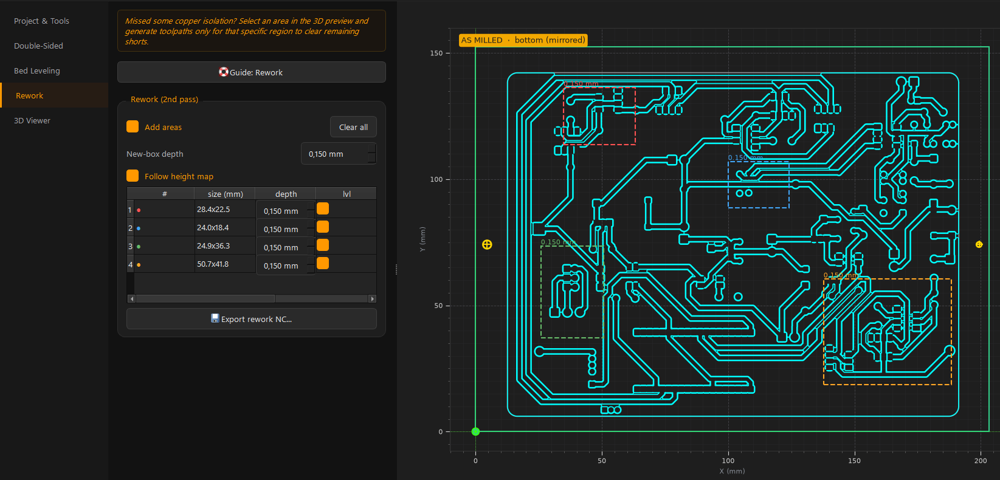
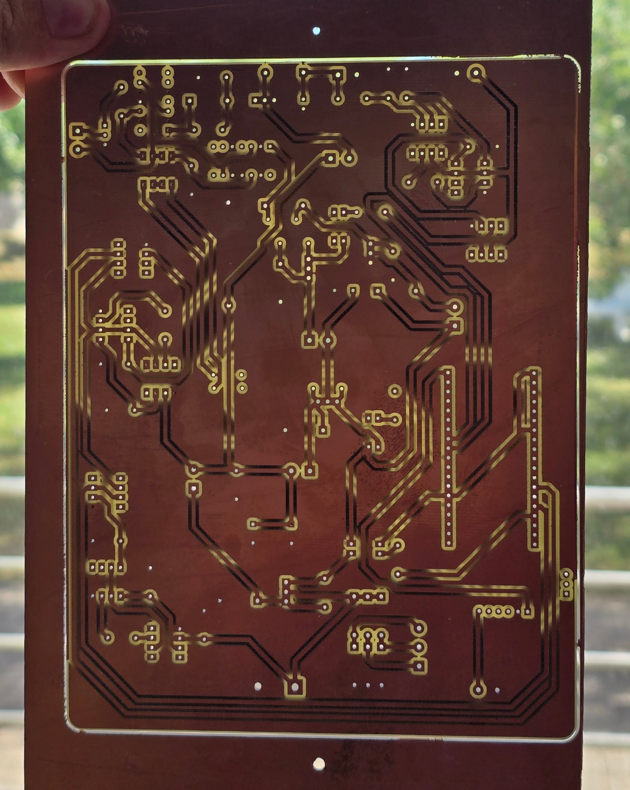
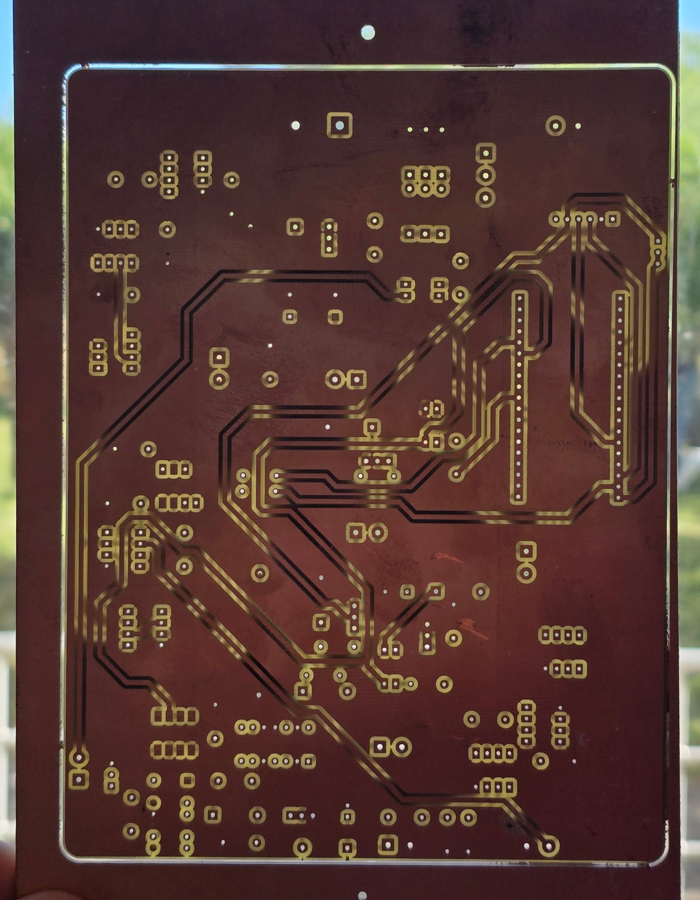

# SRM-CAM

[](https://github.com/MadsRudolph/srm-cam/actions/workflows/tests.yml)
[](https://github.com/MadsRudolph/srm-cam/actions/workflows/build.yml)

Desktop CAM for the **Roland SRM-20** mill: load KiCad **Gerber + Excellon**,
preview the toolpaths, and export **G-code** (`.nc`) or RML. One tool we own,
replacing the mods site and FlatCAM.

> Python package name: `gerber2rml`.

**📖 User guide: [madsrudolph.github.io/srm-cam](https://madsrudolph.github.io/srm-cam/)**



## Install

**Just run it (Windows):** download the latest installer from
[Releases](https://github.com/MadsRudolph/srm-cam/releases) and run
`SRM-CAM-Setup-*.exe`. No Python needed.

**From source:**

```bash
pip install -e ".[gui]"
python -m gerber2rml                                          # GUI
python -m gerber2rml.cli <gerber-folder> -o out -n <board>   # headless CLI
```

After a `git pull`, `python -m gerber2rml.doctor` installs any new dependencies.

### Linux (Fedora, Ubuntu)

Download `SRM-CAM-x86_64.AppImage` from the
[latest release](https://github.com/MadsRudolph/srm-cam/releases/latest), then:

```bash
chmod +x SRM-CAM-x86_64.AppImage
./SRM-CAM-x86_64.AppImage
```

No install step and no root. It carries its own Qt, so it does not care which
version your distribution ships.

**What Linux does not do:** the machine link — Connect, the DRO, jogging and
bed probing over the Arduino — is Windows-only. Prepare the job on Linux,
export, and send the files from VPanel on the CNC PC.

That costs less than it sounds, because a height map is a file. Probe the bed
once on the CNC PC, export the grid as CSV, and load it on Linux to export
levelled toolpaths exactly as if you had measured them there.

## What it does

- **Traces / drill / cut-out** from Gerber + Excellon, exported per operation.
- **G-code default** (`.nc`, G54 origin) for VPanel NC mode; RML available.
- **Double-sided** registration — dowel pins or measured fiducials.
- **Bed leveling** — probe a height map so depth follows an uneven surface;
  one guided button in Novice.
- **Screw fixture** — bolt the copper to the plate through the spoilboard's
  hole grid, so it cannot creep and no clamp sits in the cutter's way. Travel
  height is raised automatically to clear the screw heads.
- **Rework** — mark several spots, re-cut them in one pass at per-region depth.
- **3D views** — toolpath simulation + bed height-map.
- **Guided tour** — launches on first run; replay via the **Guide** button (and
  per-section buttons). A demo board loads so new users can follow along.

> **No hardware required.** SRM-CAM talks to a stock SRM-20 through VPanel like
> any other CAM tool. *Automatic* probing needs an Arduino on the machine's
> SPI remote header — that is the only thing that does, and bed leveling still
> works manually without it. See
> [Milling without the Arduino](docs/usage.md#milling-without-the-arduino).

## The KiCad side

A board that doesn't fit the mill is normally discovered *at* the mill, with the
layout already finished. SRM-CAM ships a small KiCad plugin that answers it in
the PCB editor instead — **Tools → External Plugins → Show SRM-20 build area**
draws the machine's build area on User.Drawings and says whether the board fits,
with the numbers.

Install it from **KiCad → Set up the build-area plugin...**; SRM-CAM copies it
into every KiCad version on the PC, and offers this once at launch if KiCad is
there and the plugin isn't. Details: [`kicad-plugin/`](kicad-plugin).

The plugin's dimensions and the CAM backend's `SRM20_BED` are asserted equal by
the test suite — one definition of the machine, so KiCad can't say a board fits
while SRM-CAM refuses to cut it.

## Two modes

**Novice** (the default on a fresh install) is the short path from Gerbers to
files you can send from VPanel — load, level, drill, traces, cut out, export.
Job parameters, double-sided, rework, the bed-leveling workbench and the live
DRO / jog / streaming dock are put away. Diagnostics, the Guide, one-button bed
leveling, `Corner = tool` and the screw fixture stay, because a beginner needs
those most — and because hiding the screw checkbox would make Novice the more
dangerous mode.

**Professional** is every control.

Novice is a strict subset, not a second program — the same settings export
byte-identical files in either mode. Switch from the **Mode** menu; set
`SRM_CAM_MODE=novice|pro` to pin a machine to one.

A course hands the same approved feeds and depths to every seat with a **site
preset**: `presets.json` next to the installed `SRM-CAM.exe`, which lives in
Program Files so only an admin can change it. See
[`docs/usage.md`](docs/usage.md#presets).

## Showcase

<table>
<tr>
<td width="50%"><br><sub><b>3D toolpath simulation</b> — orbit and play back the whole job before cutting.</sub></td>
<td width="50%"><br><sub><b>Bed height-map</b> — probe the surface so the cut depth follows the board.</sub></td>
</tr>
<tr>
<td width="50%"><br><sub><b>Double-sided</b> — dowel-pin or measured-fiducial registration for the flip.</sub></td>
<td width="50%"><br><sub><b>Rework</b> — box every spot to re-cut, each with its own depth, in one pass.</sub></td>
</tr>
</table>

You can also do **perfect double-sided PCBs** with srm-cam — both layers registered off dowel pins or fiducials. A finished board, held to the light:

<table>
<tr>
<td width="50%"><br><sub><b>Bottom — B.Cu</b></sub></td>
<td width="50%"><br><sub><b>Top — F.Cu</b></sub></td>
</tr>
</table>

## More

- **Step-by-step guide (KiCad → milled board), with photos:** [DTU Ballerup PCB prototyping — Roland CNC router](https://github.com/DTU-EKB/DTU-PCB-prototyping#making-pcbs-with-the-roland-cnc-router)
- Full usage & feature reference: [`docs/usage.md`](docs/usage.md)
- Build the installer / cut a release: [`packaging/README.md`](packaging/README.md)
- Bed-leveling probe firmware (Arduino UNO): [`hardware/srm20_spi_probe/`](hardware/srm20_spi_probe) — flash it before using auto bed leveling (wiring in [`docs/usage.md`](docs/usage.md#bed-leveling)).
- Run the tests: `pytest`

## Keeping it running

The installed app does **not** use the machine's Python — PyInstaller freezes
its own interpreter, Qt and every dependency into `_internal\`. Installing,
upgrading or removing Python on the PC cannot affect it.

What is maintained deliberately:

| | |
|---|---|
| **Reproducible builds** | `packaging/requirements-lock.txt` pins every version, including transitives, to the set the shipped installer was built from. |
| **Builds on any machine** | Pushing a `v*` tag builds the installer from scratch on a clean GitHub Windows runner and drafts a release. No one person's laptop is in the loop. |
| **Nothing silently changes** | `tests/test_golden.py` asserts a fixed board still produces byte-identical `.nc` output, so a dependency upgrade cannot quietly alter what gets cut. |
| **Early warning** | A monthly `canary` CI job runs the suite against the newest Python and newest dependencies. When the world moves, it goes red before anyone is mid-course. |

What is *not* solved by code is ownership: today the repo, the releases, the
guide site and the CI alerts all hang off one personal GitHub account, and
students graduate. The plan for that — transfer to the `DTU-EKB` org, a second
maintainer, a cold copy on lab storage — is in
**[`MAINTAINING.md`](MAINTAINING.md)**, along with the runbook for when CI goes
red and how to rebuild the installer with no GitHub at all.

Older per-branch handover notes: [`HANDOFF.md`](HANDOFF.md).
