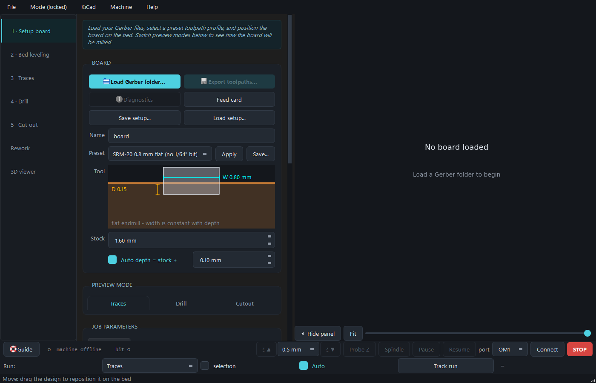
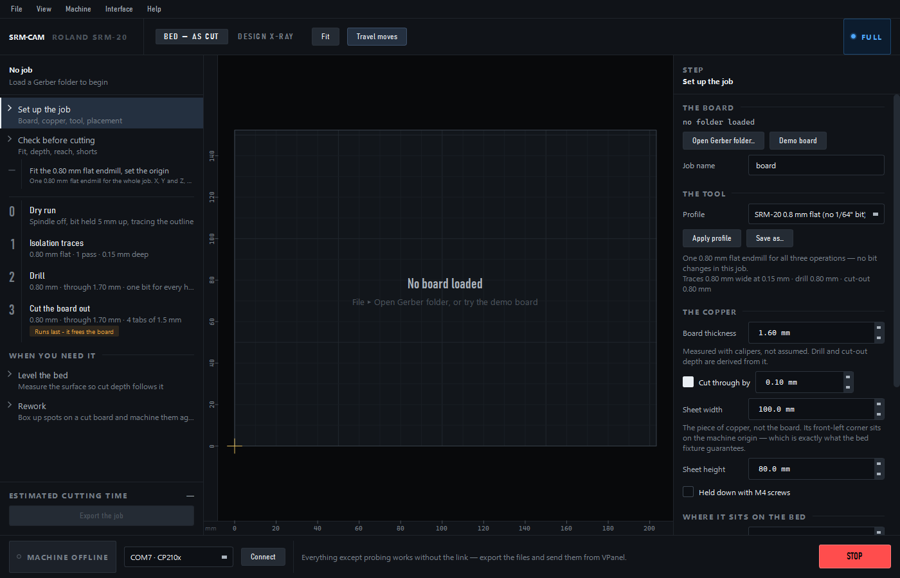
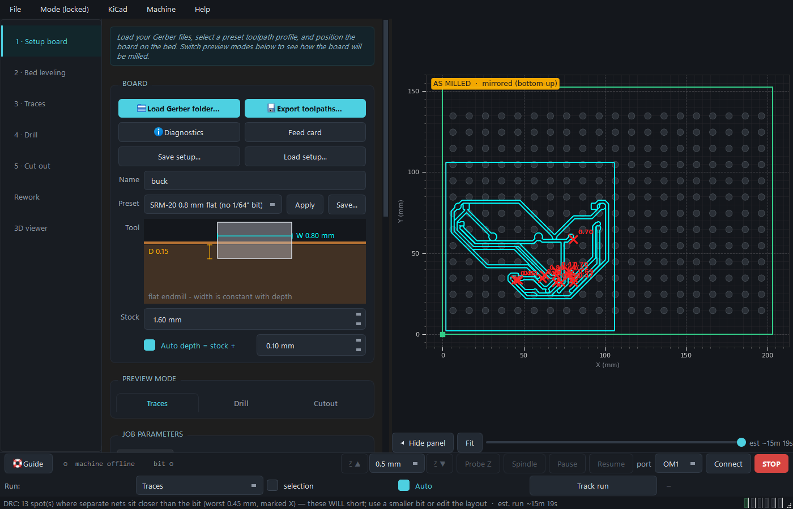
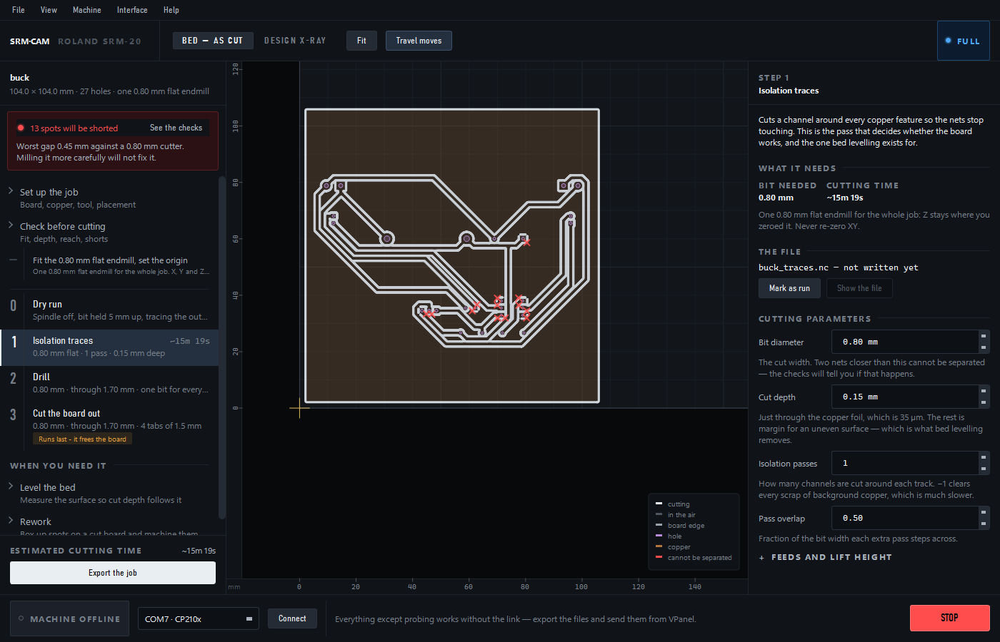
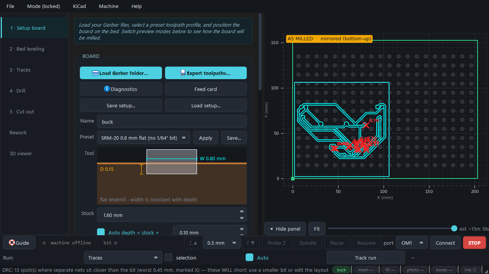
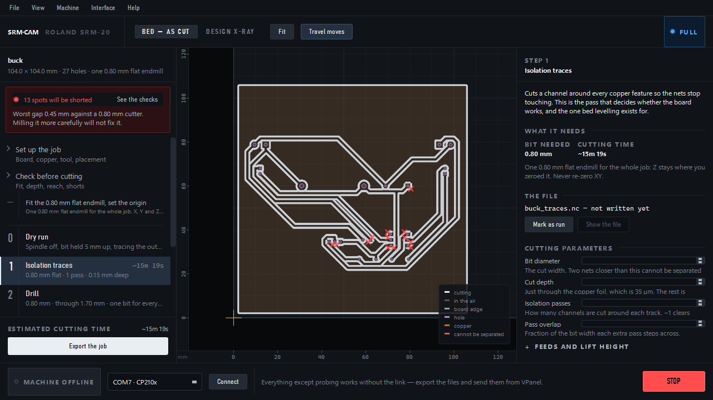
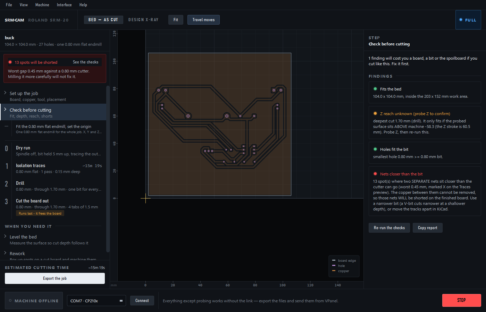
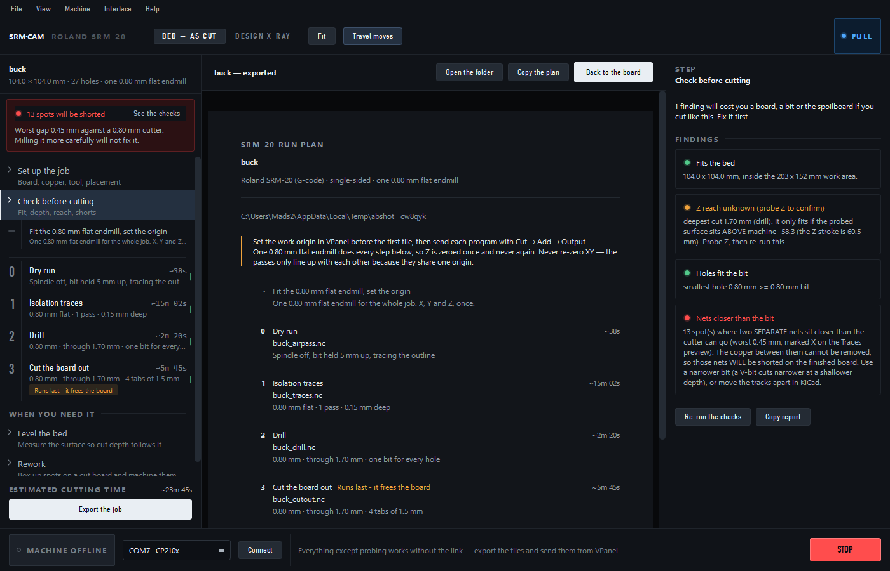
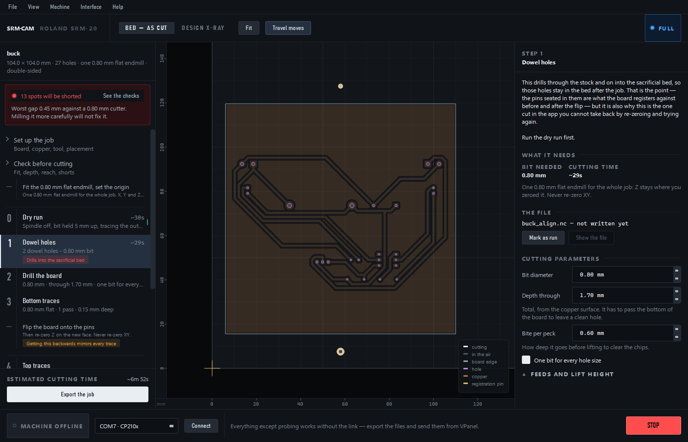
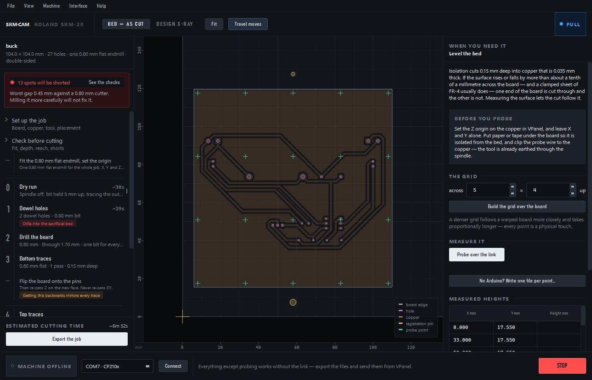

# A/B — "the setup sheet", a second interface for SRM-CAM

*Built against `docs/BRIEF-alternative-gui.md`, on `main` @ `0f771d9` (v0.4.0).
Written 2026-08-22.*

Two complete interfaces are now installed side by side over the same engine.
Nothing in `gerber2rml/gui/`, `engine/`, `app/`, `backends/`, `cli.py`,
`doublesided.py` or `config.py` was changed — `git diff` against those paths is
empty, and their tests still pass unmodified.

```bash
python -m gerber2rml          # the first interface
python -m gerber2rml.gui2     # this one
```

After a reinstall (`pip install -e .`) both are on the PATH as `gerber2rml` and
`srm-cam`. They can run at the same time, against the same board, writing to
the same workspace folder.

| | first interface | this one |
|---|---|---|
| package | `gerber2rml/gui/` | `gerber2rml/gui2/` |
| lines | 10,928 (`app.py` alone is 6,496) | 6,989 across 20 modules, largest 1,338 |
| preview | matplotlib `FigureCanvas` | `QPainter` canvas |
| tests | existing suite, unchanged | 110 new, in the same offscreen style |

Suite: **865 passed, 2 skipped** (755 existing + 110 new).

---

## 1. The idea

A machine shop hangs a **traveller** beside the job: a numbered sheet listing
every operation in order, the tool each needs, and a box to tick when it is
done. It moves with the work.

The engine already writes one — `<name>_runplan.txt` — and §3 of the brief is
right that it is the best artifact the program produces. In the first interface
it is a text file lying in a folder beside four `.nc` files, which is to say
almost nobody reads it.

So the run plan is not *a document this interface produces*. It is what the
interface **is**: the left rail is the traveller, selecting a row is how you
choose an operation, and after an export the plan itself is typeset on screen
where the board was.

Everything else follows from that one decision.

---

## 2. Side by side

### Nothing loaded — 1400 × 900

| first interface | this one |
|---|---|
|  |  |

The first interface shows a full settings form for a board that does not exist,
and the words *"No board loaded"* centred in an empty grey rectangle. This one
draws the machine bed at true size with its origin marked, so the first thing a
person learns is the shape of the work area and where its zero is — which is
what they will be asked about thirty seconds later. The rail already shows the
whole job they are about to do.

### Isolation traces — 1400 × 900

| first interface | this one |
|---|---|
|  |  |

### The same, at 1280 × 720

| first interface | this one |
|---|---|
|  |  |

At 720 px of height the first interface loses its preview-mode tabs, its whole
job-parameter block and half of the field it was in the middle of drawing; its
three stacked bottom bars still take 115 px. This one loses nothing that was on
screen at 900 px except some rail scroll — the regions are fixed, so the layout
degrades by scrolling rather than by truncating.

### States the first interface does not have a screen for

| pre-flight, beside the board | the run plan, after export |
|---|---|
|  |  |

| double-sided, showing the face being cut | bed levelling |
|---|---|
|  |  |

---

## 3. What changed, and why

### 3.1 One thing selects the operation

The critique found **four** controls that select the operation, two of them
nested tab bars with identical labels, which can disagree with each other.

Here there is one: the row you click in the traveller. It sets the stage
geometry and the inspector page together, from one handler. There is no preview
-mode tab bar, no run-operation dropdown, and no second copy of the step list.
`test_the_traveller_is_the_only_selector` and `test_only_one_row_is_ever_selected`
hold it there.

### 3.2 The order is generated, not written down

The app used to state the machining order in three places that could disagree,
and reconciling them took a commit of its own (`1d1d789`).

`gui2/runplan.py` is one list of steps, and the rail, the stage, the inspector
and the printed sheet are all renderings of it. The order is not invented
there: `tests/test_gui2_runplan.py` exports the demo board through the real
engine, both single- and double-sided, and asserts that the plan's file names
are exactly the toolpath files the engine wrote, **in that sequence**. Add a
file to `cli.build_jobs` and forget the rail, and the test fails.

### 3.3 The run plan reaches the user

The success state of an export is not "wrote 6 files". It is the plan, typeset
on the stage where the board was, with the folder one click away and a **Copy
the plan** button for a lab logbook. It is styled as a document — paper values,
a 700 px measure, rules instead of boxes — because that is what it is.

### 3.4 The finding that does not expire

*"13 spots will be shorted"* used to be a status-bar message with a
twelve-second timeout, on a screen the user was about to scroll.

It is now a banner at the top of the rail. It carries the count and the worst
gap, it offers the action that resolves it, and it stays until the thing it is
about stops being true — `test_a_board_that_will_short_says_so_and_keeps_saying_it`
walks the entire plan and asserts it is still there at every step. Exporting
anyway still needs a modal confirmation, phrased as a question about the
**layout**, because milling it more carefully will not help.

### 3.5 The checks are on screen, not in a message box

The same `engine.diagnostics.preflight` call, rendered beside the board you are
fixing instead of in a `QMessageBox` that takes the findings with it when you
dismiss it.

### 3.6 Errors say what to do

The critique counted **26 dialogs whose entire body is `str(e)`** — "Load
failed: list index out of range".

Every failure here goes through `dialogs.report_error(headline, exc, guidance)`,
which forces three separate things to exist: what failed in the user's terms,
what to do about it, and — folded away under *Technical detail* — what the
system actually said. A folder that is not a board now says what a board folder
looks like. `test_error_reporting_is_the_only_error_path_in_the_interface`
asserts no bare message boxes exist anywhere in the package;
`test_a_failed_export_explains_itself_without_a_raw_exception` asserts the
guidance is not just the exception again.

### 3.7 The panels stop moving

The first interface's settings column resizes itself from 513 px to 1032 px as
you walk its run plan, and overwrites any splitter position you set. Here the
rail and the inspector are fixed widths and the inspector is a stack — one page
per kind of step, each sized for its own content.
`test_the_panels_do_not_resize_as_you_walk_the_plan` walks every step and
asserts one single pair of widths.

### 3.8 The hands-on steps are real ones, and only real ones

Setting the origin, changing a bit and flipping the board are **rows in the
plan** with their own page, because they are where boards actually get
scrapped: a wrong bit is a ruined trace pass, a re-zeroed XY origin is a job
whose passes no longer register with each other, and a flip about the wrong
axis mirrors every trace while the registration still looks perfect.

The important half is that they are **derived, not assumed**. This lab runs one
0.8 mm flat endmill for isolation, drilling *and* the cut-out — it never leaves
the collet — so on a normal job the plan contains **no bit-change step at all**,
and says once, at the top, that one bit does the whole thing and Z is zeroed
once. Switch to the V-bit profile and exactly one change step appears, between
the traces and the drilling, because that is where the tool actually changes.
Turn off single-bit drilling and one appears per hole size.

Tools are compared by identity, not by diameter, so a 30° V-bit is never
mistaken for a flat endmill whose numbers happen to line up.
`test_gui2_runplan.py` walks the plan tracking what is in the collet and
asserts every operation has the tool it needs — which catches a missing
bit-change step *and* a superfluous one.

Fixing this also surfaced a gap: the plan had no step for **setting the work
origin**, and the dry run holds the bit 5 mm above the work Z zero. Step 0 was
meaningless until that zero existed. It is now the first row.

### 3.9 It stays responsive on a board that fills the bed

Found by using it on a real 104 mm double-sided board. Dragging the job across
the bed re-read the Gerbers off disk, re-mirrored both copper layers and re-ran
the isolation offsetter **on every mouse-move** — 185 ms a frame, so the board
crawled behind the cursor.

Three changes, each measured on that board at 1400x900:

| | before | after |
|---|---|---|
| one mouse-move of a drag | 184.8 ms | **3.4 ms** |
| repaint with a live tool marker (3 Hz while linked) | 193.8 ms | **4.1 ms** |
| re-selecting a step already drawn | 233 ms | **16 ms** |

* **A drag moves pixels, not geometry.** Nothing is regenerated until the mouse
  comes up; the work is blitted at an offset and committed once.
* **The layout is cached on its shape, not its position.** Building it re-reads
  the Gerbers and reflects both faces; moving it is a handful of translates,
  which is what `doublesided._offset_layout` — the engine's own function — is
  for.
* **The drawn scene is cached, and only the overlays stay live.** A trace pass
  for a full-bed board is ~21,000 path elements stroked at true cut width. The
  position readout polls three times a second, and each poll was re-stroking
  every one of them.

Every "make it fast" test in `test_gui2_stage.py` is paired with one that
asserts the picture still changes when it should — a caching bug in a viewer
always looks the same from the outside.

### 3.10 One button puts the job on the bed

A board that nearly fills the machine does not want nudging into place a
millimetre at a time. **Centre it on the bed** (Ctrl+B) drops the whole job into
the middle of the travel with the spare room shared equally on all four sides,
and says what that room is — the honest measure of how much there is to be
wrong by. On a double-sided job it counts the registration pins, which sit
*outside* the board: a placement that puts the board on the bed but a dowel off
it is a job that cannot be run. If the job is bigger than the machine can
reach it still centres — sharing the overhang is the least-bad answer — but it
says so instead of reporting success.

---

## 4. The visual language

The brief's §4 asks for something that reads as instrument software. The
direction here is **an instrument panel, not a dashboard**, and it makes two
decisions the first interface does not.

**The chrome has no colour.** The first interface applies one cyan accent
evenly to buttons, headings, checkboxes, links, tab underlines and section
titles — so colour has stopped carrying information, and when something finally
goes red it has to compete with cyan already covering the screen. Here the
furniture is neutral all the way through, and every chromatic token answers a
question: copper is the material, violet is a hole, brass is a pin or a screw,
mint is a probe point, red is *stops work or cannot be undone*, amber is *look
at this*, green is *checked and passed*, and blue is *the wire is live*.

Emphasis without hue is done with weight, size and a near-white fill: the
primary button is the brightest object on its panel, and there is exactly one
per panel. `test_the_chrome_is_neutral` and
`test_the_meaningful_colours_are_actually_coloured` keep both halves honest.

"The wire is live" and "this check passed" are different questions. The first
interface learned that and answered it with *two greens*; two greens still have
to be told apart at a glance, across a workshop, by someone holding a bit — so
here they are different hues, and a test asserts it.

**The type scale has a range.** The first interface lives between 11 px and
14 px and attempts hierarchy with four font weights inside a 3 px band. This
scale runs 10 → 34 and pairs three faces that mean different things:

| face | job |
|---|---|
| **Bahnschrift** (DIN 1451) | the instrument voice — headings, step numerals, tracked all-caps labels |
| **Segoe UI** | prose. Anything read as a sentence |
| **Cascadia Mono** | machine facts only — coordinates, file names, G-code. If it is in mono, the machine said it |

Bahnschrift is the typeface on machine plates and road signs, ships with
Windows 10/11, and does not look like a web app. Every family is a stack with
real fallbacks; nothing depends on a font existing, only on the scale, which
`test_the_type_scale_has_a_real_range` asserts survives the trip through
`theme.font()`.

No emoji and no icon font. The handful of glyphs that earn their place — a
state dot, a chevron, the tool crosshair, the caution triangle — are drawn with
`QPainter` at the size they are used.

### Vocabulary

Every label is the operator's word, not the variable name. `xy_feed` is *"how
fast it moves across the copper"*; `travel_z` is *"lift between cuts"*;
`offsets` is *"isolation passes"*; `clr L` and `drift chk 6` are gone. Where a
term is genuinely domain jargon it is used consistently and explained the first
time it appears — the field for isolation passes says what −1 does, and the one
for cut depth says that copper foil is 35 µm and the rest is margin for an
uneven surface.

---

## 5. The stage

Painting the canvas directly instead of plotting into matplotlib costs about
760 lines and buys three things.

**No figure furniture.** A plot frame, tick labels and an axis title say *"this
is a figure in a paper"*. The scale here sits in the margin as two edge rulers,
so the canvas says *"this is a bed"*, which is what it is.

**Cutting moves are drawn at their real width.** A toolpath drawn as a
one-pixel line tells you where the bit goes. Drawn at the bit's diameter it
tells you *what copper survives*, which is the question the operator actually
has — and it makes a too-fat bit obvious at a glance instead of at the
multimeter. Below ~1.5 px of real width it falls back to a hairline, because a
sub-pixel stroke is a lie in the other direction. This is the single most
visible difference between the two previews.

**One frame, and it is the machine's.** The canvas is always in bed
coordinates — the frame VPanel, the position readout and the operator's hands
are in, and the only one in which clicking to jog is truthful. The design frame
is an explicit **Design X-ray** toggle, and when it is on the whole canvas is
tinted and the badge says *"NOT WHAT THE MACHINE CUTS"*, so the two can never
be mistaken for one another. Every serious scare in this program's history has
been a coordinate-frame presentation problem, so on a double-sided job the
top-side steps now draw the **top face with its holes reflected about the flip
axis** — where the board physically will be in that setup, not where it is now.

Shorts are marked in device space so they stay findable when you zoom out to
check placement, which is exactly when you most want to know the board has
thirteen of them.

---

## 6. The safety properties, and how each is held

Every non-negotiable in §3 of the brief, with the thing that keeps it true.

| § | property | how |
|---|---|---|
| Bed levelling has a visible stop | **structural** — the machine bar is not in a dock, a tab or any panel a tier can hide, and it is the only place the machine can be made to move from | `test_stop_is_always_visible_and_always_enabled` walks every step in both tiers; `test_stop_lives_outside_every_hideable_container` asserts the button is not a descendant of the rail, the inspector, the stack or the stage |
| STOP reaches a probe run | the grid prober opens the serial port itself, so the link releases it — but the run polls the link's shared abort event, so STOP still stops it and the firmware lifts the tool | `MachineLink.mark_external` / `stop_now` |
| STOP with no link | never a dead grey button: it says to use the machine's own emergency stop, or close the lid, because the spindle will not run with it open | `test_stop_says_something_useful_with_no_link` |
| Escape stops the machine | bound as an `ApplicationShortcut`, so it works with any widget focused | `test_escape_is_bound_to_stop_application_wide` |
| The dry run comes first | step **0** in the plan, with a full page explaining that the spindle never starts and the bit is held 5 mm up, so the file *cannot* cut. The one row before it sets the work origin, because "5 mm up" is measured from that zero | `test_single_sided_plan_starts_with_the_dry_run`, `test_the_origin_step_comes_before_the_dry_run` |
| Bit-change steps are real | derived from the tools, so a one-bit job has none and says so once. Tools compared by identity, not diameter | `test_one_bit_for_the_whole_job_means_no_bit_change_steps`, `test_a_bit_change_step_appears_exactly_where_the_tool_changes` |
| The cut-out runs last | last in the plan, with a red *"Runs last — it frees the board"* chip; on a double-sided job it is after the flip and the top traces | `test_the_cut_out_is_last_and_says_why`, `test_double_sided_puts_the_cut_out_after_the_flip` |
| Irreversible actions look different | red fill, neutral default, and a tick that must be set before the red button works. Used for the dowel holes (they go into the bed), the bed fixture, and clearing a height map | `dialogs.confirm_irreversible`; `test_the_dowel_step_is_marked_irreversible` |
| Spindle speed is not settable | there is a spindle button and no speed control anywhere; the tooltip says the machine ignores the value and the speed comes from VPanel's slider | `test_nothing_implies_the_spindle_speed_is_settable` |
| Streaming is not the happy path | Machine menu, full tier only, behind a dialog carrying the whole warning — including that the speed units are uncalibrated and what a dry run guarantees mechanically | `test_essential_puts_away_the_experimental_stream` |
| Only proven status bits shown | the cover/lid bit (`0x20000`) is the only one that becomes a state on screen. The bit Roland labels "paused" is read and never displayed | `MachineBar._on_status` |
| XY origin never moves | there is a control that zeroes Z and none that zeroes XY, and every bit-change step says *"Z only, never XY"* | `test_nothing_offers_to_zero_the_xy_origin` checks what is actually clickable; `test_every_hands_on_step_says_never_xy` |
| One order, stated once | see §3.2 | `test_gui2_runplan.py` |
| The run plan reaches the user | see §3.3 | `test_the_run_sheet_replaces_the_board_after_an_export` |
| Shorts before export | persistent banner + a blocking confirmation | `test_a_board_that_will_short_says_so_and_keeps_saying_it` |
| Simple tier output is byte-identical | one code path; the tier hides widgets and nothing else | `test_the_two_tiers_export_identical_bytes` exports the same board in both and compares bytes |
| Screw heads vs travel height | ticking *held down with M4 screws* raises the lift on all three operations, and only ever raises | `test_the_screw_checkbox_raises_the_lift_height`, `…never_lowers_a_value_someone_set` |
| No raw colour literals | one palette module, enforced over the package and the stylesheet | `tests/test_gui2_theme.py` |

### Where the tier line falls, and why it moved

The first interface splits by **control**: Novice hides the job-parameter
forms, the machine dock, double-sided and rework. That split had one bad
consequence its own commit log records (`38626a1`) — hiding the machine dock
hid the STOP button, so guided bed levelling had to be pulled out of Novice
entirely to stop Novice being the *more* dangerous mode.

This interface splits by **task**. `ESSENTIAL` carries the whole single-sided
job **including levelling**, because probing is the single most useful thing
the Arduino buys someone who has never run this machine: isolation cuts 0.15 mm
into copper 0.035 mm thick, so a tenth of a millimetre of bow is the difference
between a track that is isolated and one that is still joined to its
neighbour. It can do that safely because the stop control is not in a hideable
panel.

`FULL` adds what assumes you already know the machine: per-operation cutting
parameters, double-sided, rework, output format, the experimental stream, and
saving tool profiles. Both properties from `mode.py` are kept — hidden not
disabled, and a strict subset — and both are tested
(`test_essential_is_a_strict_subset`, `test_the_two_tiers_export_identical_bytes`).
`SRM_CAM_MODE` still pins it, and still accepts `novice`/`pro`, so a lab that
has already pinned its seats does not have to do it twice.

---

## 7. What was kept from the first interface

§6 of the brief lists what represents real thinking. Taking each in turn:

- **The run-plan spine** — kept and made structural. It is now the only
  navigation, and it is generated from the engine's own file order rather than
  maintained alongside it. *"A map, not a gate"* is preserved literally: every
  row is clickable at every moment, and marking a step done is a note to
  yourself, never a permission (`test_every_step_is_reachable_at_any_time`).
- **`mode.py`'s reasoning** — read, kept, and argued with in `gui2/tier.py`,
  which cites it. Hidden-not-disabled and strict-subset survive; where the line
  falls changed, for the reason above.
- **The tooltips** — the convention is kept, though not yet the count: 48
  against the first interface's 126, and they are explanations rather than
  label restatements. Several pre-empt the exact
  misconception the control could cause (the screw checkbox explains the
  invisible collision; the spindle button explains where the speed really comes
  from; the scale checkbox on the fiducial fit explains that it can absorb real
  error into a fake stretch and make a bad fit look good).
- **The safety copy** — the stream dialog still says the move count, what a dry
  run guarantees *mechanically*, what a wet run needs from you first, and that
  the speed units are uncalibrated. Nobody who reads it can be surprised.
- **The code comments** — the convention that a non-obvious decision carries
  its reason, and often the incident that caused it, is followed throughout.

---

## 8. What this interface does not do

Stated plainly, because a comparison is worthless if one side is quietly
smaller.

**Not ported:**

- the **guided tour** (`gui/tour/`) — the first-launch walkthrough;
- the **3D viewer** and the G-code simulation window;
- the **photo overlay** and the phone-photo QR hand-off;
- the **machine test panel** — the PASS/FAIL/UNKNOWN SPI command probe. §6 of
  the brief is right that it is well designed; it is a diagnostic for the
  people who develop the link, and it did not fit the scope agreed for this
  build. `scripts/srm20_bench.py` does the same from a terminal;
- the **feed test card**;
- **snap-to-feature jogging** (click-to-jog is here; the snap is not);
- the **KiCad plugin** menu and the update check.

**Deliberately different rather than missing:**

- there is no equivalent of the *Guide* button, because the explanations were
  moved into the steps themselves — each run step has a page saying what it
  does and why, and Help ▸ How this works is a short orientation rather than a
  replayable tour. Whether that is better is exactly the sort of thing this A/B
  is for;
- the **bed fixture** and **hold-down screw** exports are in the Machine menu
  rather than on a page, since they are cut once per spoilboard;
- **rework** is a page reached from the rail rather than a mode with its own
  photo overlay; boxes are dragged on the same stage as everything else.

**Fixed along the way, and worth knowing about:** the *Travel moves* toggle was
switching an empty layer on and off. The engine's toolpath model contains no
traverse moves — each contour is its own path that begins with a rapid to its
own start — so every "rapid" run is a pure Z retract at a single XY and draws as
nothing at all. The traverses are now synthesised from the end of one path to
the start of the next, which is exactly the motion the run-time estimator was
already charging for.

**Known rough edges:**

- toolpath generation is synchronous. On a full-bed board the isolation pass
  takes about a second the first time you select the traces step, and the stage
  shows *"Working out the toolpath…"* while it does. It is cached after that,
  but it belongs on a worker thread;
- switching between two steps that draw different geometry costs a re-stroke
  (~170–230 ms on a full-bed board). Only an unchanged view is a blit;
- the estimate is the engine's, and the engine's is known to run 20–50 % low
  because it ignores acceleration (`engine/estimate.py` has the TODO). This
  interface shows it with that caveat on the tooltip rather than fixing the
  estimator;
- the rail scrolls on a double-sided job at 720 px of window height.

---

## 9. Running the comparison

```bash
python -m gerber2rml.doctor      # GUI dependencies
python -m pytest -q              # 865 passed, 2 skipped
python -m gerber2rml             # first interface
python -m gerber2rml.gui2        # this one
```

Both do the whole single-sided job end to end against
`tests/fixtures/mosfet_test` — load, place, inspect, diagnose, export — and
both handle the awkward states: no board loaded, a board with 13 guaranteed
shorts, no machine connected, an export that fails.

Both windows are titled *SRM-CAM 0.4.0* — deliberately, since each is meant to
be judged as the product rather than as an experiment. On a taskbar they are
told apart by the fourth menu: the first interface has **Mode**, this one has
**Interface**. On screen they are not remotely confusable.

A fair twenty minutes: load the fixture in both, walk to the traces step in
each, read what each tells you about the thirteen shorts, export both, and then
try to find out from each one **what order to run the files in and which bit
each needs** without opening a text editor.

The screenshots in `docs/images/ab/` were captured from the real windows at
both sizes; `scripts` for them are not committed — they are eleven lines of
`w.resize(); w.grab().save()`.
